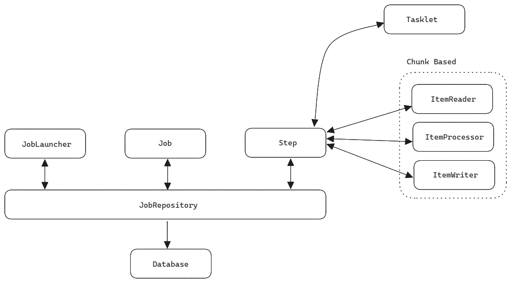
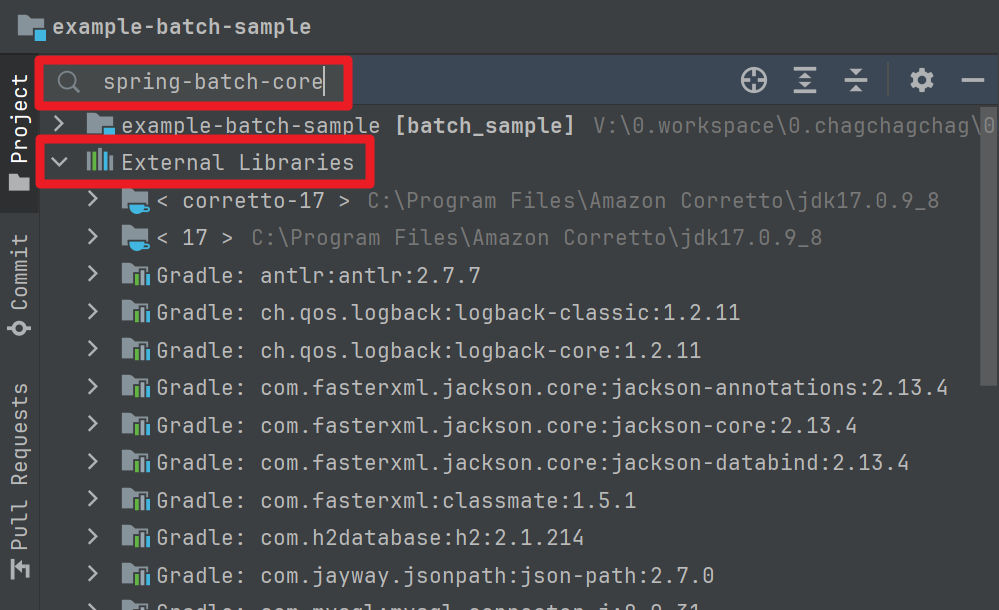
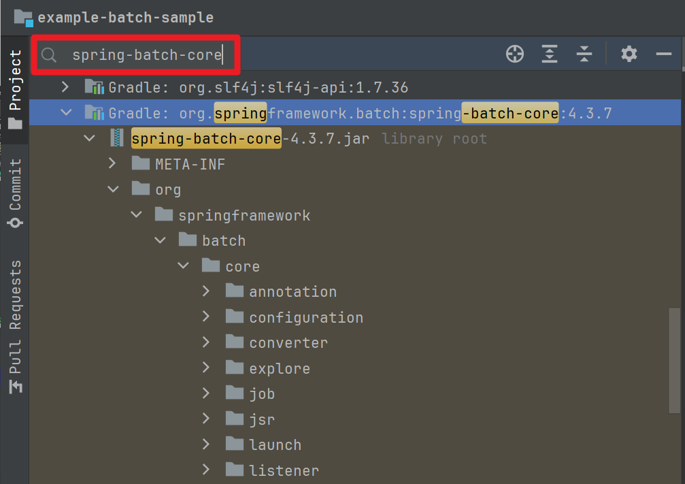
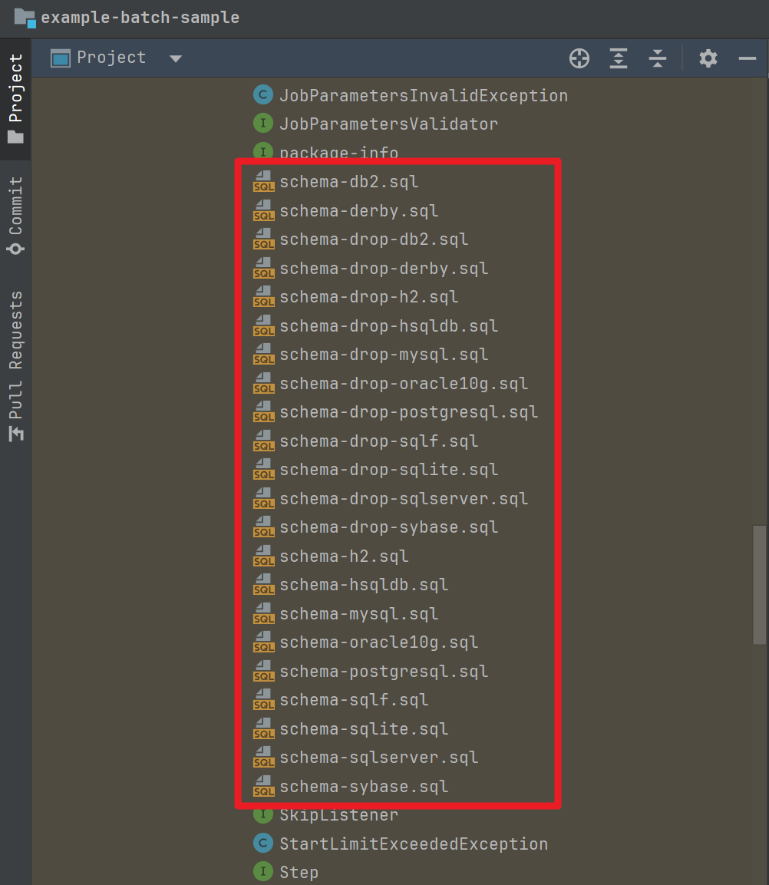
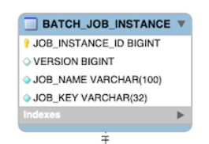
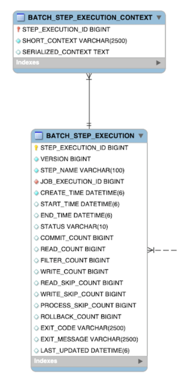

## 기본 구조

참고 : https://docs.spring.io/spring-batch/docs/4.3.5/reference/html/job.html


<br/>


## JobLauncher, JobRepository, Job, Chunk, Tasklet,  ItemReader, ItemProcessor, ItemWriter




<br/>


### JobLauncher

- Bean 을 생성만 했을 뿐인데 Batch가 실행된다. 
  - application.yml 에 아래의 설정을 추가하면, 원하지 않는 Job 들이 실행되는 것을 막을 수 있습니다.
  - `spring.batch.job.enabled: ${spring.batch.job.names:NONE}` 
  - `spring.batch.job.names: ${job.name.NONE}`

- Spring Batch 는 Job 타임에 Bean 이 생성되면 JobLauncher 객체에 의해서 Job 을 수행합니다.
- JobLauncher 는 Job 을 실행하고, Job 은 Step 을 수행합니다.

<br/>


### JobRepository

- DB or Memory 에 스프링 배치가 실행될 수 있도록 배치의 메타데이터를 관리하는 역할을 수행

<br/>


### Job

- **배치의 실행단위** (중요!!)

- Job 은 JobLauncher 에 의해 실행됩니다.
- Job 은 여러 개의 Step 을 실행하며, Flow 를 관리할 수 있습니다.
  - e.g. Step A → on 조건 B → Step B
  - 이렇게 여러개의 Step 을 Flow 로 실행하는 것을 Job Flow 라고 부릅니다.

<br/>


### Chunk, Tasklet

예를 들어 100만건의 데이터를 처리해야 하는 작업이 있다고 하자.<br/>


만약 100만건의 데이터에 대해 원하는 작업을 할 때 컴퓨터 자원에 문제가 없다면? 

- Tasklet 처리를 해도 무방합니다.

<br/>

만약 100만건의 데이터에 대해 원하는 작업을 할 때 컴퓨터 자원에 문제가 있다면? 

- Chunk 기반의 처리를 하는 것이 권장됩니다.
- 1만건 Size 의 Chunk 를 만들어서 이 Chunk 를 페이징 기반의 처리를 하는 방식으로 전환한다면, 메모리가 부족해져서 프로그램이 멈추는 현상 등을 방지할 수 있습니다. 
- 뒤에서 정리하겠지만, 가급적이면 페이징 사이즈는 Chunk Size 와 동일하게 하는 것이 권장됩니다.

<br/>

> Tasklet 도 나눠서 처리하는 것을 수동으로 작성할 수 있지만 <br/>
>
> 대용량 데이터를 처리시에는 Chunk 기반 처리방식이 더 활용성이 높고 ItemReader, ItemProcessor, ItemWriter 등을 통해서 딱딱 떨어지게끔 처리하면서 중간에 어디까지 실행했는지에 대한 Context 를 저장하거나 이력을 보관할 수 있기에 가급적이면 Chunk 기반의 처리를 하도록 작성하는 것을 추천되는 편입니다.<br/>

<br/>


### ItemReader, ItemProcessor, ItemWriter

ItemReader

- 배치 처리를 해야 하는 대상 객체를 읽어들이는 역할
- e.g. `FlatFileItemReader`, `JdbcPagingItemReader`, `JpaPagingItemReader`

ItemProcessor

- ItemReader 로부터 읽어들인 데이터를 ItemWriter 로 보내기 전에 Processing 또는 Filtering 작업을 수행하는 역할
- null 을 리턴하면 그 데이터는 필터링 되어 ItemWriter 로는 전달되지 않습니다.
- ItemProcessor 는 Optional 이며, 생략가능하다. 즉, Step 구성시 ItemReader, ItemWriter 로만 구성하는 것도 가능합니다.

ItemWriter

- ItemProcessor 로부터 전달된 객체를 이용해서 데이터를 저장하거나, 메시지큐에 데이터를 전송하는 등과 같은 Write 하는 역할을 담당합니다.

<br/>


## Sprng Batch Tables

### Table 명세

Spring Batch 는 배치 실행 기록과, 배치 실행 결과를 저장하는 테이블들을 가지고 있습니다. 이 테이블들을 Meta 테이블이라고 흔히 이야기합니다.<br/>

참고 : https://docs.spring.io/spring-batch/reference/_images/meta-data-erd.png


<br/>


BATCH\_JOB\_INSTANCE

- 위의 ERD 에서 BATCH\_JOB\_INSTANCE 테이블을 자세히 보면 `JOB_NAME`, `JOB_KEY` 이 보입니다.
- 배치 실행 시에는 `JOB_NAME`, `JOB_KEY` 를 기준으로 하나의 row 가 생성되는데, 이 `JOB_NAME`, `JOB_KEY` 는 중복을 허용하지 않습니다. 
- 즉, JobInstance 의 생성기준, BATCH\_JOB\_INSTANCE 테이블의 로우(ROW) 생성기준은 `JOB_NAME`, `JOB_KEY`이며 `JOB_NAME`, `JOB_KEY`은 중복되면 안됩니다.
- `JOB_KEY` 값은 BATCH\_JOB\_EXECUTION\_PARAMS 테이블 내에 저장되는 Parameter 를 나열해서 암호화해서 저장합니다.


BATCH\_JOB\_EXECUTION\_PARAMS

- Job 을 실행할 때 사용된(주입된) Parameter를 저장하는 테이블입니다.


BATCH\_JOB\_EXECUTION

- Job 의 시작시각, Job의 종료시각, Job 의 상태 를 기록하기 위한 테이블입니다.
- Job 이 실행되는 시점에 BATCH\_JOB\_EXECUTION 테이블에 데이터가 추가됩니다.


BATCH\_JOB\_EXECUTION\_CONTEXT

- Job 이 실행되는 동안 공유되어야 하는 데이터를 직렬화 해서 저장합니다.


BATCH\_STEP\_EXECUTION

- Step 이 실행되는 동안 필요한 데이터와 실행 결과를 저장합니다.


BATCH\_STEP\_EXECUTION\_CONTEXT

- Step 이 실행되는 동안 공유되어야 하는 데이터를 직렬화해서 저장합니다.
- 이 테이블에서는 하나의 Step 이 실행되는 동안 데이터를 공유합니다.
- 이 테이블에서는 Step 간에 테이블의 데이터를 공유하지 않으며, Step 간에 데이터를 공유하는 것은 BATCH\_JOB\_EXECUTION\_CONTEXT 에서 데이터를 공유할 수 있습니다.

<br/>


### Schema 스크립트 경로

테이블 ddl 이 있는 곳의 경로는 `spring-batch-core/org.springframework/batch/core*` 입니다.<br/>

intellij 에서는 아래와 같이 찾으실 수 있습니다.<br/>


Project View \> External Libraries 에서 `spring-batch-core` 를 검색합니다.



<br/>


검색결과로 `spring-batch-core-a.b.c.jar` 파일이 검색되었음을 확인 가능합니다.



<br/>


스크롤을 내려보면 아래 그림처럼 `schema-{db 타입}.sql` 파일들이 나타나는 것을 볼 수 있습니다.



위와 같이 Spring Batch 팀에서는 Spring Batch 라이브러리에 필요한 스키마들을 class path 내에서 찾을 수 있도록 제공해주고 있습니다.<br/>


### batch table 초기화 옵션

batch 테이블 초기화 옵션은 application.yml 파일에 아래와 같이 설정할 수 있습니다.

```yaml
spring:
  batch:
    initialize-schema: never
```

이 속성에는 아래와 같은 값들을 지정 가능합니다.

- `spring.batch.initialize-schema=never` 
  - 배치 잡 기동시 스키마 초기화 스크립트를 실행하지 않는 방식입니다. 
  - 주로 Production 레벨에서 사용하는 옵션입니다.
- `spring.batch.initialize-schema=always`
  - 배치 잡 기동시 스키마 초기화 스크립트를 항상 수행하도록 지정하는 방식입니다.
  - 주로 개발환경에서 사용하는 옵션입니다.
- `spring.batch.initialize-schema=embedded` 
  - 배치 잡 기동시 스키마 초기화 스크립트를 h2 와 같은 embedded (내장) Database 를 사용할 때에만 사용할 수 있도록 지정하는 방식입니다.
  - 주로 개발환경에서 사용하는 옵션입니다.

<br/>


### 객체 매핑

참고 : https://terasoluna-batch.github.io/guideline/5.0.0.RELEASE/en/Ch02_SpringBatchArchitecture.html#Ch02_SpringBatchArch_Detail_ProcessFlow


- JobInstance 객체 : BATCH\_JOB\_INSTANCE 테이블에 매핑
- JobExecution 객체 : BATCH\_JOB\_EXECUTION 테이블에 매핑
- JobParameters 객체 : BATCH\_JOB\_EXECUTION\_PARAMS 테이블에 매핑
- ExecutionContext 객체 : BATCH\_JOB\_EXECUTION\_CONTEXT 테이블에 매핑

<br/>


## JobInstance, JobParameters, JobExecution



**JobInstance**<br/>

JobInstance 는 BATCH\_JOB\_INSTANCE 테이블과 매핑되는 테이블입니다. JOB\_INSTANCE 테이블의 주요 컬럼으로는 JOB\_NAME, JOB\_KEY 가 있습니다. 그리고 `JOB_NAME`, `JOB_KEY` 를 기준으로 하나의 row 가 생성되는데, 이 `JOB_NAME`, `JOB_KEY` 는 중복을 허용하지 않습니다. <br/>

즉, JobInstance 의 생성기준, BATCH\_JOB\_INSTANCE 테이블의 로우(ROW) 생성기준은 `JOB_NAME`, `JOB_KEY`이며 `JOB_NAME`, `JOB_KEY`은 중복되면 안됩니다.<br/>

<br/>


**JobParameter, JobExecution**<br/>

JobInstance 를 새로 생성할지에 대한 기준은 JobParameter 의 중복 여부로 결정합니다.<br/>

- 같은 Parameter 로 Job을 다시 실행하면 이미 생성된 JobInstance 를 실행합니다.<br/>

- 다른 Parameter 로 Job을 다시 실행하면 새로운 JobInstance 를 실행합니다.<br/>

<br/>


JobExecution 은 JobInstance 재실행 여부와 상관 없이 항상 새롭게 생성됩니다.<br/>


e.g.

- Job 실행시 12월 1일 이라는 date parameter 를 처음 받아서 실행했다면?
  - job\_instance\_id = k 에 해당하는 신규 JobInstance 실행
- Job 실행시 12월 2일 이라는 date parameter 를 처음 받아서 실행했다면?
  - job\_instance\_id = m 에 해당하는 신규 JobInstance 실행
- Job 실행시 12월 2일 이라는 date parameter 를  한번 더 받아서 실행했다면?
  - job\_instance\_id = m 에 해당하는 JobInstance 를 재실행

<br/>


## RunIdIncmenter

Job 을 항상 새로운 JobInstance로 실행되게끔 해야 할 경우가 있습니다. <br/>

이런 경우 RunIdIncrementer 를 사용합니다. <br/>

RunIdIncrementer 를 사용하면 `run.id` 라는  `job_key` 에 대해 항상 다른 `job_name` 값이 지정되어서 항상 새로운 JobInstance 로 실행됩니다.<br/>

<br/>


## StepExecution, ExecutionContext



StepExecution : BATCH\_STEP\_EXECUTION 테이블에 매핑되는 객체

ExecutionContext : BATCH\_STEP\_EXECUTION\_CONTEXT 테이블에 매핑되는 객체

- JOB, STEP 에 모두 매핑될 수 있는 객체입니다.
- 참고\) BATCH\_JOB\_EXECUTION\_CONTEXT 테이블은 ExecutionContext 객체와 매핑됩니다.

<br/>


## 요약

하나의 Job 은 항상 같은 파라미터로 새롭게 실행하는 것은 불가능합니다.<br/>

ExecutionContext 는 Job, Step 의 Context 를 관리하는 객체입니다.<br/>

- ExecutionContext 를 통해서 데이터를 공유할 수 있습니다.

JobExecutionContext<br/>

- Job 내에서만 데이터를 공유할 수 있습니다
- JobExecutionContext 는 Step 끼리 데이터를 공유할 수 있습니다.

StepExecutionContext<br/>

- Step 내에서만 데이터를 공유할 수 있습니다.
- Step 내에서만 공유하다는 의미이며, 다른 Step 과는 공유가 불가능합니다.

<br/>


## ExecutionContext 

Job 내에서 서로 다른 Step A, B 가 실행되게끔 Job 을 구성했다고 하겠습니다.

- TODO : 예제 추가 필요


JobExecutionContext

- Job 내에서만 데이터를 공유할 수 있습니다
- JobExecutionContext 는 Step 끼리 데이터를 공유할 수 있습니다.

StepExecutionContext

- Step 내에서만 데이터를 공유할 수 있습니다.
- Step 내에서만 공유하다는 의미이며, 다른 Step 과는 공유가 불가능합니다.


