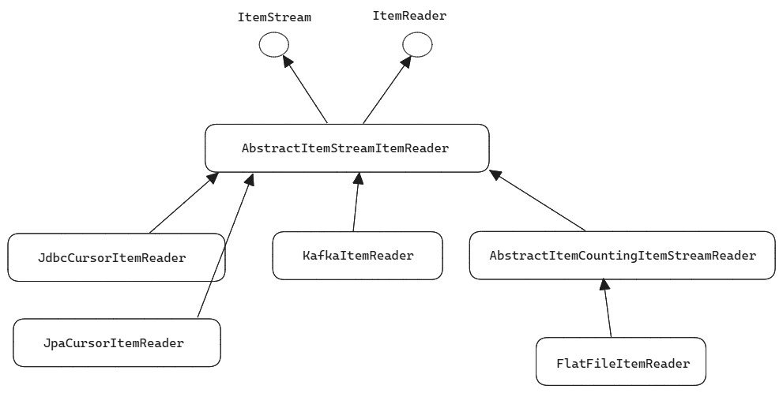
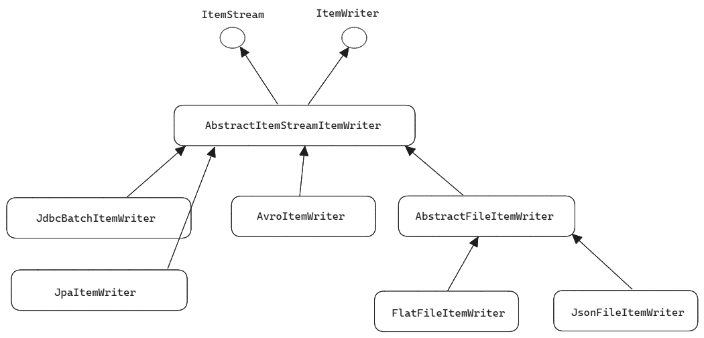

## Spring Batch Essential

## 참고자료

- [Spring Batch란? 이해하고 사용하기](https://khj93.tistory.com/entry/Spring-Batch%EB%9E%80-%EC%9D%B4%ED%95%B4%ED%95%98%EA%B3%A0-%EC%82%AC%EC%9A%A9%ED%95%98%EA%B8%B0)

<br/>


## Tasklet vs Chunk Based Processing

Tasklet 기반 처리

- 배치 처리 과정의 구조가 단순할 경우에 사용합니다.
- 대용량 데이터 처리 시에 데이터를 여러 덩어리로 나눠서 처리하기에는 복잡한 구조입니다.
- 대용량 데이터 처리를 할 경우 시스템의 자원이 부족하게 될 수 있다는 단점이 있습니다.


Chunk 기반 처리

- ItemReader, ItemProcessor, ItemWriter 를 이용해서 데이터를 처리합니다.
- 이렇게 ItemReader, ItemProcessor, ItemWriter 를 이용한 데이터 처리를 Chunk Based Processing 이라고 부릅니다.
- 대용량 데이터 처리 시에 데이터를 Chunk 단위로 나누고 이 Chunk 를 Paging 기반으로 여러 단계로 나누어 처리합니다.
- 데용량 데이터 처리 시에 시스템의 자원이 부족해지는 현상 없이 안정적으로 처리할 수 있다는 장점이 있습니다. 
- e.g. 10만개의 데이터를 10000 size 의 chunk 단위로 처리하는 경우

<br/>


## Job, Step, Reader, Processor, Writer

> !!!정리 예정

<br/>


## JobParameters

배치 실행시 필요한 파라미터를 주입할 때 JobParameters 객체를 사용합니다.<br/>

**파라미터 접근**<br/>

파라미터 접근 시에는 아래의 두 방식으로 접근 가능합니다

- JobParameters 를 이용한 파라미터 접근
  - e.g. `String parameter = jobParameters.getString(key, defaultValue)`
- Spring EL (Expression Language) 로 접근
  - e.g. `@Value("#{jobParameters[key]}")`

<br/>


**파라미터 주입**<br/>

파라미터를 주입하는 방식은 아래와 같습니다.

- Intellij 에서 실행 또는 jar 파일 실행시 Program Argument 를 `-{파라미터명}` 으로 전달하는 방식
- Controller 및 기타 엔드포인트에서 직접 인자를 전달하는 방식

<br/>


e.g. 주입된 Job 파라미터를 Spring EL 을 이용해서 읽어들이는 예제입니다.

```java
@Bean
@JobScope
public Step chunkBaseStep(@Value("#{jobParameters[orderId]}") String orderId){
    String orderId = StringUtils.isNotEmpty(orderId) 
        ? Long.parseLong(orderId)
        : -1L;
    
    return stepBuilderFactory.get("somethingStep")
        .<String,String>chunk(CHUNK_SIZE)
        .reader(itemReader(orderId))
        .processor(itemProcessor())
        .writer(itemWriter())
        .build();
}
```

<br/>


## AbstractItemStreamItemReader

> 참고 - [docs.spring.io/.../AbstractItemStreamItemReader](https://docs.spring.io/spring-batch/docs/current/api/org/springframework/batch/item/support/AbstractItemStreamItemReader.html)
>
> - 몇몇 클래스는 UML 에서 생략했습니다.

AbstractStreamItemReader 는 ItemStream interface, ItemReader interface 를 implements 하고 있는 abstract 클래스입니다. 주로 잘 짜여진 Spring 등과 같은 프레임워크에서는 abstract 클래스로 기본틀 역할을 하는 클래스를 제공하는데, AbstractItemStreamItemReader 클래스 역시 필요한 기본적인 구현이 갖춰져 있는 **기본 틀** 역할을 합니다.<br/>



<br/>


**AbstractItemStreamItemReader 를 extends 하는 대표적인 구현체 클래스들**<br/>

- [JdbcCursorItemReader](https://docs.spring.io/spring-batch/docs/current/api/org/springframework/batch/item/database/JdbcCursorItemReader.html), [JpaCursorItemReader](https://docs.spring.io/spring-batch/docs/current/api/org/springframework/batch/item/database/JpaCursorItemReader.html)
- [KafkaItemReader](https://docs.spring.io/spring-batch/docs/current/api/org/springframework/batch/item/kafka/KafkaItemReader.html)
- [AbstractItemCoutingItemStreamItemReader](https://docs.spring.io/spring-batch/docs/current/api/org/springframework/batch/item/support/AbstractItemCountingItemStreamItemReader.html)
  - 대표적으로 FlatFileItemReader 가 [AbstractItemCoutingItemStreamItemReader](https://docs.spring.io/spring-batch/docs/current/api/org/springframework/batch/item/support/AbstractItemCountingItemStreamItemReader.html) 을 extends 하고 있습니다.

<br/>


**JpaCursorItemReader, JdbcCursorItemReader**<br/>

그리고 세부적으로는 JpaCursorItemReader, JdbcCursorItemReader 와 같은 하위 구현체들이 존재하며, 이 구현체들은 spring-batch 에서 Jpa, Jdbc 를 통한 Data read 연산을 효율적으로 할 수 있도록 하는 연산을 제공합니다.<br/>


## AbstractItemStreamItemWriter

> 참고 : [AbstractItemStreamItemWriter](https://docs.spring.io/spring-batch/docs/current/api/org/springframework/batch/item/support/AbstractItemStreamItemWriter.html)
>
> - 몇몇 클래스는 UML 에서 생략했습니다.




