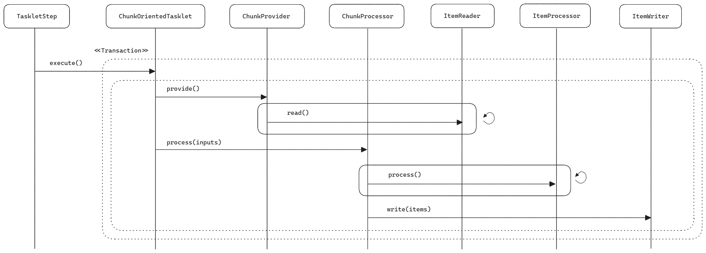
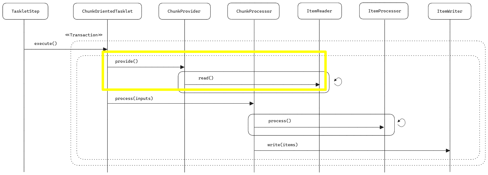
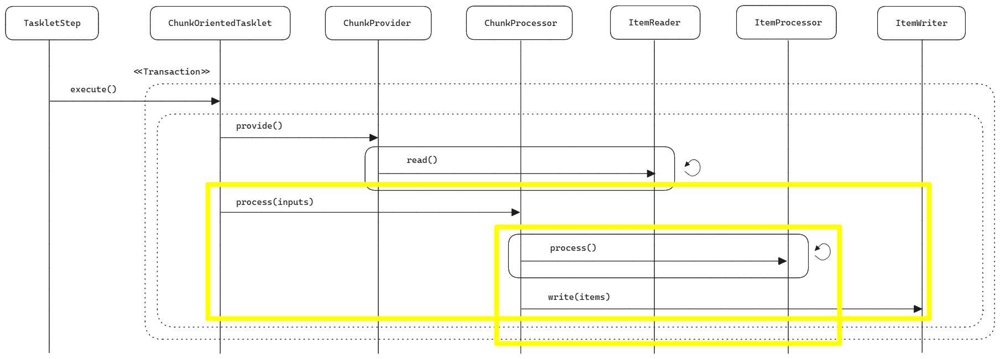

## ChunkOrientedTasklet, ChunkProvider, ChunkProcessor


## 참고자료

- [Spring Batch : ChunkOrientedTaskLet, ChunkProvider, ChunkProcessor](https://ojt90902.tistory.com/777)

> Spring Batch 에서의 Transaction 에 대한 자료들을 찾아보던 중 위의 글을 발견해서 정리를 합니다.<br/>
>
> 위의 자료는 인프런 정수원님의 강의를 듣고 정리한 블로그 문서라고 합니다.<br/>
>
> 저 역시 위의 강의를 들어보고 싶지만, 이번달 생활비가 예산 초과여서 이번 달에는 결제를 못할 것 같고 다음달에 꼭 들어볼 생각으로 장바구니에만 추가해뒀습니다. 강의 목차를 보니 꽤 충실한 내용같아서 얼른 구매해서 강의를 들어보고 싶다는 생각을 하게 되네요!!

<br/>


## 목차

- ChunkOrientedTasklet 이란, Chunk 단위 Transaction
- ChunkOrientedTasklet 의 동작 방식
- ChunkOrientedTasklet 의 주요 API
- ChunkOrientedTasklet 의 Chunk 처리시 예외발생으로 인한 재시도 방식
- ChunkProvider::provide()
- ChunkProcessor::process()

<br/>


## 1. ChunkOrientedTasklet이란, Chunk 단위 Transaction

**ChunkOrientedTasklet**<br/>

ChunkOrientedTasklet 은 Spring Batch 에서 제공하는 Tasklet 인터페이스의 구현체입니다. 내부적으로는 Chunk 를 가지고 있기에 Chunk 기반의 프로세스 처리가 가능하며, ItemReader, ItemProcessor, ItemWriter 를 가지고 있기에 ItemReader, ItemProcessor, ItemWriter 을 활용해서 Chunk Process 처리를 합니다.<br/>

내부적으로는 Repeat Template 을 가지고 있습니다.<br/>

그리고 ChunkOrientedTasklet 은 Chunk 단위로 트랜잭션을 커밋합니다.<br/>

<br/>


**Chunk 단위 Transaction**<br/>

ChunkOrientedTasklet 은 Chunk 단위로 트랜잭션을 커밋합니다.<br/>

ChunkOrientedTasklet 은 ChunkOrientedTasklet 이 실행될 때마다 새로운 트랜잭션이 생성된 상태에서 처리가 이뤄집니다. <br/>

이 트랜잭션 단위 내에서는 Exception 이 발생한다면 Rollback 이 이뤄집니다. 참고로 예외 발생시 예외 발생 전에 이미 Commit 이 완료된 Chunk 는 그대로 유지됩니다. <br/>

ChunkOrientedTasklet 은 Chunk 단위로 트랜잭션을 커밋하기 때문에 이렇게 Chunk 단위 내에서 예외가 발생하면 그 Chunk 에서 처리하던 Transaction 은 Rollback 을 하게 됩니다.<br/>

Chunk 처리 중 예외가 발생해서 재시도를 해야 할 경우, 데이터를 다시 읽지 않고 버퍼(=ChunkContext)에 담아둔 데이터를 가져옵니다. 이 재시도를 할 때 내부적으로 어떻게 하는지, 데이터를 새로 읽어오는지 에 대해서는 아래의 [4. 재시도 방식 : ChunkOrientedTasklet 의 Chunk 처리시 예외 발생으로 인한 재시도 방식](/docs-spring-batch/chunk-oriented-tasklet--chunk-provider--chunk-processor/#chunkorientedtasklet-%EC%9D%98-chunk-%EC%B2%98%EB%A6%AC%EC%8B%9C-%EC%98%88%EC%99%B8-%EB%B0%9C%EC%83%9D%EC%9C%BC%EB%A1%9C-%EC%9D%B8%ED%95%9C-%EC%9E%AC%EC%8B%9C%EB%8F%84-%EB%B0%A9%EC%8B%9D) 섹션에서 정리합니다.<br/>

> [4. 재시도 방식 : ChunkOrientedTasklet 의 Chunk 처리시 예외 발생으로 인한 재시도 방식](/docs-spring-batch/chunk-oriented-tasklet--chunk-provider--chunk-processor/#chunkorientedtasklet-%EC%9D%98-chunk-%EC%B2%98%EB%A6%AC%EC%8B%9C-%EC%98%88%EC%99%B8-%EB%B0%9C%EC%83%9D%EC%9C%BC%EB%A1%9C-%EC%9D%B8%ED%95%9C-%EC%9E%AC%EC%8B%9C%EB%8F%84-%EB%B0%A9%EC%8B%9D)<br/>
>
> - 실패 후 재시도시 데이터를 새로 읽어올 경우 기존 데이터와 다를 수 있기에 내부적으로 ChunkContext 라고 불리는 버퍼를 사용하는데, 이 버퍼에 데이터를 어떻게 저장하는지 등과 관련된 내용을 다룹니다.


<br/>


## 2. ChunkOrientedTasklet 의 동작 방식



execute()

- TaskletStep 은 execute() 메서드를 호출해서 ChunkOrientedTasklet 을 실행합니다.

ChunkOrientedTasklet::provide()

- ItemReader 를 통해서 Chunk에 저장할 item을 읽어옵니다.
- 이때 Chunk 내에서 처음 불러오는 것이라면 트랜잭션을 열어줍니다.
- 이 데이터는 ChunkSize 만큼의 데이터입니다.

ChunkOrientedTasklet::process(inputs)

- ItemReader가 읽어들인 InputChunk 를 ChunkProcessor::process() 메서드에 전달됩니다.

ItemProcessor::process()

- ChunkProcessor 에서부터 Input Chunk 는 ItemProcessor::process() 에서 단건으로 처리됩니다. 
- ItemProcessor::process() 의 결과는 OutputChunk에 하나씩 들어갑니다.

ItemWriter::write(items)

- Output Chunk 가 ItemWriter 에 전달되며, 이 OutputChunk 는 ItemWriter 에서는 배치(덩어리)처리 됩니다.

<br/>


## 3. ChunkOrientedTasklet 의 주요 API

\<I,O\> chunk(int chunkSize)

- chunkSize 설정
- 다르게 이야기하면, commit 인터벌을 의미합니다. 
- 스프링 배치의 ChunkOrientedTasklet 은 chunk 단위로 트랜잭션을 새로 열기 때문에 commit 인터벌 이라는 말로 설명할 수 있습니다.

\<I,O\> chunk(CompletionPolicy)

- Chunk Process 를 완료하기 위한 설정 클래스를 지정합니다.

reader()

- ItemReader 구현체를 지정하는 메서드 입니다.

writer()

- ItemWriter 구현체를 지정하는 메서드 입니다.

processor()

- ItemProcessor 구현체를 지정하는 메서드입니다.
- Optional 하게 지정가능하며, ItemProcessor 가 필요없다면 지정해주지 않아도 됩니다.

stream()

- 재시작 데이터를 관리하는 콜백에 대한 stream 을 지정하는 메서드 입니다.

readerIsTransactionalQueue()

- Item 이 JMS 와 같은 트랜잭션 트랜잭션 외부에서 읽혀지고 캐시할 것인지를 지정하는 메서드입니다.

listener

- 리스너를 지정할 때 사용하는 메서드입니다.

build

- build 메서드를 통해 객체를 생성합니다.

<br/>


## 4. 재시도 방식 : ChunkOrientedTasklet 의 Chunk 처리시 예외 발생으로 인한 재시도 방식

Chunk 처리 중 예외가 발생해서 재시도를 해야 할 경우, 데이터를 다시 읽지 않고 버퍼(=ChunkContext)에 담아둔 데이터를 가져옵니다.<br/>


### 내부 동작


<br/>


## ChunkProvider::provide()



<br/>


ChunkProvider interface 는 provide(), postProcess() 메서드를 제공합니다.

```java
package org.springframework.batch.core.step.item;

import org.springframework.batch.core.StepContribution;

public interface ChunkProvider<T> {
  Chunk<T> provide(StepContribution var1) throws Exception;

  void postProcess(StepContribution var1, Chunk<T> var2);
}
```

이 ChunkProvider interface 를 구현하는 구현체들은 다음과 같습니다.

- FaultTolerantChunkProvider
- JsrChunkProvider
- **SimpleChunkProvider**

<br/>


이번 문서에서는 위의 구현체 들 중 SimpleChunkProvider 클래스의 provide() 메서드의 동작을 살펴봅니다.

<br/>

### SimpleChunkProvider::provide()

```java
public class SimpleChunkProvider<I> implements ChunkProvider<I> {
    public Chunk<I> provide(final StepContribution contribution) throws Exception {
        // (1) 
        final Chunk<I> inputs = new Chunk();
        
        // (2) repeatOperations.iterate(new RepeatCallback(){...})
        this.repeatOperations.iterate(new RepeatCallback() {
          public RepeatStatus doInIteration(RepeatContext context) throws Exception {
            I item = null;
            Timer.Sample sample = Timer.start(Metrics.globalRegistry);
            String status = "SUCCESS";

            label45: {
              RepeatStatus var6;
              try {
                // (3) 
                item = SimpleChunkProvider.this.read(contribution, inputs);
                break label45;
              } catch (SkipOverflowException var10) {
                status = "FAILURE";
                var6 = RepeatStatus.FINISHED;
              } finally {
                SimpleChunkProvider.this.stopTimer(sample, contribution.getStepExecution(), status);
              }

              return var6;
            }

            if (item == null) {
              // (4)
              inputs.setEnd();
              return RepeatStatus.FINISHED;
            } else {
              // (5) 
              inputs.add(item);
              contribution.incrementReadCount();
              return RepeatStatus.CONTINUABLE;
            }
          }
        });
        
        return inputs;
	}
}
```


- (1) : Chunk 객체를 새로 생성합니다. ChunkProvider 는 provide() 메서드가 호출될 때마다 새로운 Chunk 객체를 생성합니다.
- (2) 
  - Iterator 패턴 기반인 RepeatOperations 를 기반으로 iterate 를 수행합니다.
  - 내부적으로는 doInIteration 클래스를 구현하고 있습니다.
- (3) 
  - SimpleChunkProvider 내의 read(Contributuion, inputs) 를 통해 소스로부터 item 을 읽어옵니다.
- (4) 
  - 읽어온 item 이 없을 경우에는 종료하는데 inputs.setEnd() 를 호출해서 종료합니다.
- (5)
  - 읽어온 item 이 있는 경우 Input Chunk 인 inputs 에 넣어줍니다. (inputs.add(item) )

<br/>


## ChunkProcessor



<br/>

ChunkProcessor interface 는 process() 메서드를 제공합니다.

```java
package org.springframework.batch.core.step.item;

import org.springframework.batch.core.StepContribution;

public interface ChunkProcessor<I> {
  void process(StepContribution var1, Chunk<I> var2) throws Exception;
}
```

이 ChunkProcessor interface 를 구현하는 구현체들은 아래와 같은 구현체들이 있습니다.

- FaultTolerantChunkProcessor
- JsrChunkProcessor
- JsrFaultTolerantChunkProcessor
- **SimpleChunkProcessor**

<br/>


이번 문서에서는 위의 구현체 들 중 SimpleChunkProcessor 클래스의 process() 메서드의 동작을 살펴봅니다.<br/>

<br/>


### SimpleChunkProcessor::process()

```java
public class SimpleChunkProcessor<I, O> implements ChunkProcessor<I>, InitializingBean {
    // ...
    public final void process(StepContribution contribution, Chunk<I> inputs) throws Exception {
        this.initializeUserData(inputs);
        
        if (!this.isComplete(inputs)) {
            // (1)
            Chunk<O> outputs = this.transform(contribution, inputs); 
            // (2) 
            contribution.incrementFilterCount(this.getFilterCount(inputs, outputs)); 
            // (3)
            this.write(contribution, inputs, this.getAdjustedOutputs(inputs, outputs));
        }
    }
}
```

- (1) : transform(contribution, inputs);
  - transform() 메서드는 nputChunk 를 itemProcessor 에 전달해서 Output Chunk 를 만들어오는 역할을 수행합니다.
  - transform() 메서드는 아래에서 설명합니다.
- (2) : incrementFilterCount()
  - Processor 의 Process 과정에서 filter 에 부합하는 유효한 값들만 필터링하며 카운트를 합니다.
- (3) : write(contribution, inputs, this.getAdjustedOutputs(inputs, outputs));
  - (1), (2) 에서 구한 OutputChunk 를 ItemWriter 에 전달해줍니다.
  - write() 메서드는 아래에서 설명합니다.

<br/>


### SimpleChunkProcessor::transform()

> 참고 : SimpleChunkProcessor

위에서 살펴본 ChunkProcessor::process() 메서드는 transform() 메서드를 호출하고 있는데, transform() 메서드의 내부 정의는 아래와 같이 정의되어 있습니다.

```java
public class SimpleChunkProcessor<I, O> implements ChunkProcessor<I>, InitializingBean {
    // ...

    protected Chunk<O> transform(StepContribution contribution, Chunk<I> inputs) throws Exception {
        Chunk<O> outputs = new Chunk(); // (2)
        Chunk<I>.ChunkIterator iterator = inputs.iterator();

        while(iterator.hasNext()) {
          I item = iterator.next();
          Timer.Sample sample = BatchMetrics.createTimerSample();
          String status = "SUCCESS";

          Object output;
          try {
            output = this.doProcess(item); // (1)
          } catch (Exception var13) {
            inputs.clear();
            status = "FAILURE";
            throw var13;
          } finally {
            this.stopTimer(sample, contribution.getStepExecution(), "item.process", status, "Item processing");
          }

          if (output != null) {
            outputs.add(output); // (2)
          } else {
            iterator.remove(); // (2)
          }
        }

        return outputs; // (2)
  	}
}
```


- (1)
  - transform 메서드는 while 문을 통해서 doProcess(item) 을 itemSize 만큼 처리해줍니다. 
  - 즉, item 을 하나씩 단건으로 Processing 합니다.
- (2)
  - 새로운 Chunk\<O\> outputs 객체를 만든 후, 이 outputs에 처리 결과를 add() 하거나, remove() 해서 처리 대상 데이터에서 필터링합니다.
  - 그리고 이 Chunk\<O\> outputs 을 return 합니다.

<br/>


### SimpleChunkProcessor::write()

```java
public class SimpleChunkProcessor<I, O> implements ChunkProcessor<I>, InitializingBean {
    // ...
    
    protected void write(StepContribution contribution, Chunk<I> inputs, Chunk<O> outputs) throws Exception {
        Timer.Sample sample = BatchMetrics.createTimerSample();
        String status = "SUCCESS";

        try {
          // (1)
          this.doWrite(outputs.getItems());
        } catch (Exception var10) {
          inputs.clear();
          status = "FAILURE";
          throw var10;
        } finally {
          this.stopTimer(sample, contribution.getStepExecution(), "chunk.write", status, "Chunk writing");
        }

        contribution.incrementWriteCount(outputs.size());
	}
    
    // ...
    protected final void doWrite(List<O> items) throws Exception {
        if (this.itemWriter != null) {
            try {
                this.listener.beforeWrite(items);
                // (2)
                this.writeItems(items);
                this.doAfterWrite(items);
            } catch (Exception var3) {
                this.doOnWriteError(var3, items);
                throw var3;
			}
        }
	}
}
```

<br/>

- (1)
  - doWrite() 메서드에 outputs.getItems() 를 넘겨줍니다. outputs.getItems() 는 Output Chunk 의 List 입니다.
- (2)
  - doWrite(...) 메서드에서는 writeItems(items) 메서드에 items 전체를 넘겨줍니다.
  - 이로 미루어볼수 있는 것은 ItemWriter 는 데이터를 배치단위(덩어리)로 한번에 처리한 다는 사실을 알수 있습니다.